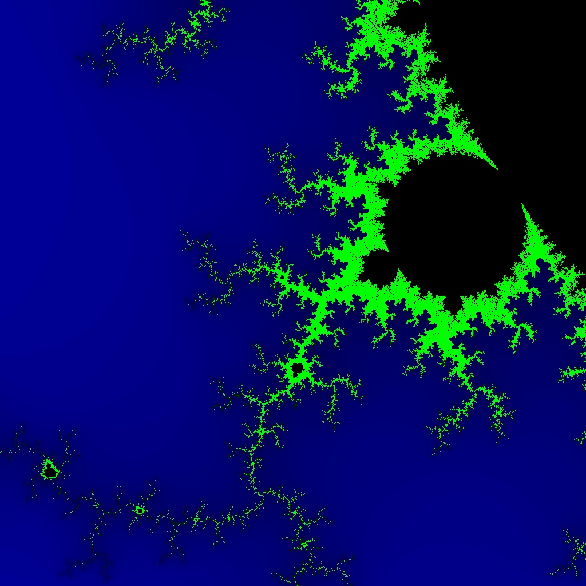

# Mandelbr-Go-t

[](https://drone.andr.io/betandr/mandelbrgot)

Emits a mandelbrot set as a PNG. Uses a logarithmic colorscheme from blue to green.



```
func mandelbrot(z complex128) color.Color {
	const iterations = 200
	const contrast = 15
	var v complex64
	for n := uint8(0); n < iterations; n++ {
		v = v*v + complex64(z)
		if cmplx.Abs(complex128(v)) > 2 {
			switch {
			case n > 50:
				return color.RGBA{0, 255, 0, 255}
			default:
				logScale := math.Log(float64(n)) / math.Log(float64(iterations))
				return color.RGBA{0, 0, 255 - uint8(logScale*255), 255}
			}
		}
	}
	return color.Black
}
```
